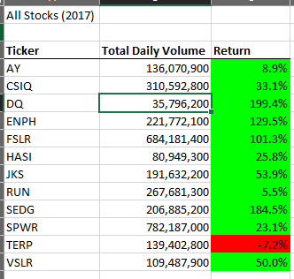
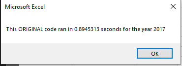

# Stock Analysis

## Overview of the Project:
Steve recently graduated with a finance degree. His parents are so proud that they decided to be his first client. Steve's parents are passionate about green energy and believe that it is the future. Without much knowledge of the industry, they invested all their money into Daqo New Energy Corporation (ticker: DQ), a company that makes silicon wafers for solar panels. Steve is concerned about diversifying their funds. He wants to analyze a handful of green stocks including DQ.

### Purpose
Steve has created an excel file containing the stock data he wants analyzed. Using VBA, we can create a tool that will help automate the calculations and use complex logic to perform the analysis. The tool should be flexible to allow him to reuse the code with any stock and reduce the chance of errors. 

## Results
The chart below shows the summary of the calculations Steve specified in his request. It lists each ticker’s total daily volume and the return ((Ticker end price/Ticker start price) -1). 
In terms of stock performance, it seems that 2017 was a bullish year for the green energy sector.

Regarding the performance of the code, the original code performed poorly against the refactored code (see screenshots below).  To compare the speed between the code, we take the timings of the original code and then divide it by the timings of the refactored code. Therefore, 0.894/0.128 which is equal to 7.21. This means that the refactored code executed 7.21 times faster than the original code for the 2017 dataset.

As for the 2018 dataset, the original execution time is at 0.925 and the Refactored time is at 0.125. In this case, the refactored code is 7.4 times faster than the original code. 

## Summary

### Advantage and Disadvantages of Refactoring code
Generally, the advantages of refactoring code is that it leads to better quality code; it improves the design, makes code easier to understand, helps find bugs and makes the execution time faster. 
As for disadvantage of refactoring code, the developer will need to constantly retest the functionality to ensure that the main function of the code is still working. If the project deadline is tight, then there might not be enough time to run these tests which could make the code run inefficiently, or worse, break it. 

### How do these pros and cons apply to refactoring the original VBA script?
We can consider refactoring process as similar to organizing your workspace. If you have a clean and organized workspace, then you can be more productive and efficient – the same goes for code.  A neat and organized code is easier to change, easier to understand and easier to maintain. However, sometimes, you don’t have enough time to organize your workspace and you just have to work within your limitations. 

